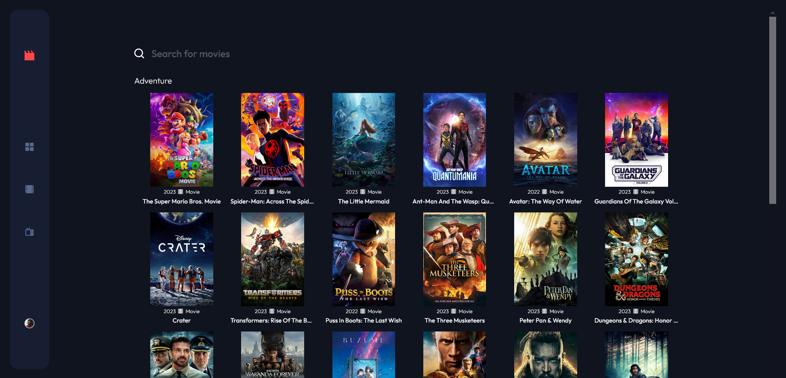

# Frontend Mentor - Entertainment web app solution

This is a solution to the [Entertainment web app challenge on Frontend Mentor](https://www.frontendmentor.io/challenges/entertainment-web-app-J-UhgAW1X). Frontend Mentor challenges help you improve your coding skills by building realistic project.

## Overview

### The challenge

Users should be able to:

- View the optimal layout for the app depending on their device's screen size
- See hover states for all interactive elements on the page
- Navigate between Home, Movies, TV Series
- Search for relevant shows on all pages

### Screenshot

 </img>

### Links

- Solution URL: https://www.frontendmentor.io/solutions/react-typescript-vite-tmdb-api-qaP9nO6x1t
- Live Site URL: https://mediasearch-ee.netlify.app/

## My process

### Built with

- HTML
- CSS
- React (TypeScript)
- Vite (for development)
- TMDB API (https://www.themoviedb.org/)
